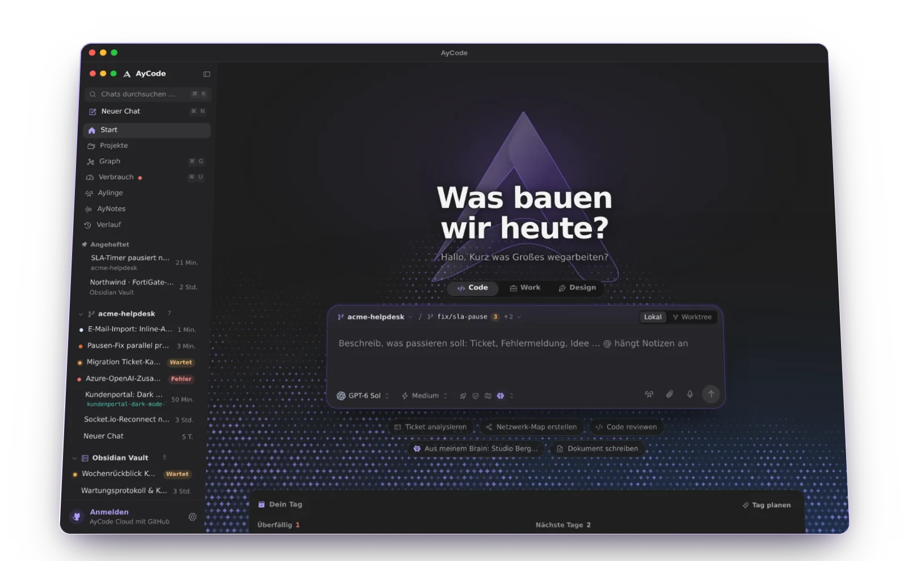

<a href="README.md">English</a> · <b>Deutsch</b>

<a href="https://aycode.app/de/">
<picture>
  <source media="(prefers-color-scheme: dark)" srcset=".github/readme/hero-de-dark.svg">
  <source media="(prefers-color-scheme: light)" srcset=".github/readme/hero-de-light.svg">
  
</picture>
</a>

<h3>AyCode bringt Claude Code, Codex, Gemini, Grok und alle anderen Coding-Agenten in eine ruhige Desktop-App. Dein Obsidian-Vault wird zum Second Brain hinter jeder Antwort.</h3>

<a href="https://aycode.app/de/"><b>Website</b></a>&nbsp;&nbsp;·&nbsp;&nbsp;<a href="https://aycode.app/de/docs/"><b>Doku</b></a>&nbsp;&nbsp;·&nbsp;&nbsp;<a href="#download"><b>Download</b></a>&nbsp;&nbsp;·&nbsp;&nbsp;<a href="https://github.com/Ayont/AyCode-releases/releases"><b>Versionshinweise</b></a>&nbsp;&nbsp;·&nbsp;&nbsp;<a href="https://github.com/Ayont/AyCode-releases/stargazers"><b>⭐ Stern geben</b></a>

 

<table>
<tr>
<td width="33%" valign="top"><h4>Ein Fenster für alle Agenten</h4>Claude Code, Codex, Gemini, Grok und Co. nebeneinander, das Modell mitten im Chat wechseln oder einen Prompt an mehrere schicken.</td>
<td width="33%" valign="top"><h4>Ein Gedächtnis, das bleibt</h4>Deine Obsidian-Notizen, Links und Tags gehen mit jedem Prompt mit. Was du heute entscheidest, ist nächste Woche noch bekannt.</td>
<td width="33%" valign="top"><h4>Nie blockiert von einem stillen Provider</h4>Jeder Provider läuft in einem eigenen Prozess. Hängt einer, wartet nur sein Chat, nie die App.</td>
</tr>
</table>

<h2>Was ist AyCode?</h2>

AyCode ist eine Desktop-App (GUI) für Coding-Agenten aus dem Terminal, für macOS und Windows. Statt <b>Claude Code</b>, <b>OpenAI Codex CLI</b>, <b>Gemini CLI</b>, <b>Grok</b>, <b>OpenCode</b>, <b>Cline</b>, <b>Kimi Code</b> und andere KI-Agenten in einzelnen Terminal-Tabs zu jonglieren, laufen sie nebeneinander in einem ruhigen Fenster: mit Live-Diffs, Freigaben, Git-Worktrees, Modellauswahl, Kostenübersicht und deinen Obsidian-Notizen als Langzeitgedächtnis. Agentic Coding und Vibe Coding, ohne den Überblick zu verlieren.

<picture>
  <source media="(prefers-color-scheme: dark)" srcset=".github/readme/divider-dark.svg">
  <source media="(prefers-color-scheme: light)" srcset=".github/readme/divider-light.svg">
  
</picture>

<picture>
  <source media="(prefers-color-scheme: dark)" srcset=".github/readme/title-features-de-dark.svg">
  <source media="(prefers-color-scheme: light)" srcset=".github/readme/title-features-de-light.svg">
  
</picture>

<table>
<tr>
<td width="50%" valign="top">

<h3>Alle Agenten, ein Fenster</h3>

Claude Code, Codex, Gemini, Grok, OpenCode, Cline, Kimi, Pi, Z.ai und mehr. Das Modell mitten im Chat wechseln oder mit ⇧-Klick mehrere wählen und ihre Antworten nebeneinander vergleichen.

</td>
<td width="50%" valign="top">

<h3>Ein Second Brain aus deinem Vault</h3>

AyCode indexiert deine Obsidian-Notizen im Hintergrund und gibt dem Agenten die passenden mit. Der Graph zeigt, wie dein Wissen zusammenhängt, bis zum kürzesten Weg zwischen zwei Notizen.

</td>
</tr>
<tr>
<td width="50%" valign="top">

<h3>Aylinge, deine Agenten-Crew</h3>

Agenten mit Namen, Gedächtnis und Routinen. Mehrere in einen Gruppenchat setzen, eines mit @Name ansprechen oder alle mit @alle, Provider frei gemischt.

</td>
<td width="50%" valign="top">

<h3>AyNotes</h3>

Meetings und Telefonate aufnehmen, mit Zustimmung aller. Verschriftlicht wird lokal; Zusammenfassung und offene Aufgaben landen als Notiz im Vault.

</td>
</tr>
<tr>
<td width="50%" valign="top">

<h3>Parallel in Worktrees, geprüft vor dem Merge</h3>

Mehrere Agenten gleichzeitig, jeder auf seinem Branch. Jede geänderte Zeile live sehen, Diffs kommentieren und ein zweites Modell urteilen lassen, bevor du mergst.

</td>
<td width="50%" valign="top">

<h3>AyWork und AyDesign</h3>

Dokumente, Folien, Poster und Landingpages erscheinen live auf einem Canvas, während der Agent schreibt: mit Versionen, Vorher/Nachher und Export als SVG, HTML, PNG oder PDF.

</td>
</tr>
</table>

<h3 align="center">Und viele kleine Dinge</h3>

<table>
<tr>
<td width="33%" valign="top"><b>Schnellchat</b> <kbd>⌥ Leertaste</kbd> fragt den Agenten aus jeder App.</td>
<td width="33%" valign="top"><b>/btw</b> Eine Nebenfrage, während die Hauptaufgabe weiterläuft.</td>
<td width="33%" valign="top"><b>Duo</b> Zwei Provider arbeiten abwechselnd an einem Ziel und prüfen sich.</td>
</tr>
<tr>
<td width="33%" valign="top"><b>Umzug</b> Chats aus T3 Code, Cursor, Cline, Claude Code, Codex und mehr übernehmen.</td>
<td width="33%" valign="top"><b>Team-Sessions</b> Live zusammen coden; Gäste machen im Browser mit.</td>
<td width="33%" valign="top"><b>Kosten im Blick</b> Was jeder Agent und jedes Modell diese Woche gekostet hat.</td>
</tr>
<tr>
<td width="33%" valign="top"><b>Limit-Wächter</b> Wartet, bis ein Nutzungslimit frei ist, und macht dann weiter.</td>
<td width="33%" valign="top"><b>Neun Themen</b> Von Graphit bis Tokyo Night, hell und dunkel, WCAG AA.</td>
<td width="33%" valign="top"><b>Begleiter</b> 25 kleine Figuren reagieren auf das, was deine Agenten tun.</td>
</tr>
</table>

<picture>
  <source media="(prefers-color-scheme: dark)" srcset=".github/readme/divider-dark.svg">
  <source media="(prefers-color-scheme: light)" srcset=".github/readme/divider-light.svg">
  
</picture>

<picture>
  <source media="(prefers-color-scheme: dark)" srcset=".github/readme/title-agents-de-dark.svg">
  <source media="(prefers-color-scheme: light)" srcset=".github/readme/title-agents-de-light.svg">
  
</picture>

<picture>
  <source media="(prefers-color-scheme: dark)" srcset=".github/readme/providers-dark.svg">
  <source media="(prefers-color-scheme: light)" srcset=".github/readme/providers-light.svg">
  
</picture>

Einmal pro Provider anmelden. AyCode startet deren offizielle Werkzeuge auf deinem Rechner, dein Code und deine Abos bleiben deine. <b>Kein Weiterverkauf von Tokens, AyCode speichert keine Schlüssel.</b>

<picture>
  <source media="(prefers-color-scheme: dark)" srcset=".github/readme/divider-dark.svg">
  <source media="(prefers-color-scheme: light)" srcset=".github/readme/divider-light.svg">
  
</picture>

<picture>
  <source media="(prefers-color-scheme: dark)" srcset=".github/readme/title-download-de-dark.svg">
  <source media="(prefers-color-scheme: light)" srcset=".github/readme/title-download-de-light.svg">
  
</picture>

<a href="https://github.com/Ayont/AyCode-releases/releases/latest"><picture>
  <source media="(prefers-color-scheme: dark)" srcset=".github/readme/download-mac-de-dark.svg">
  <source media="(prefers-color-scheme: light)" srcset=".github/readme/download-mac-de-light.svg">
  
</picture></a>
<a href="https://github.com/Ayont/AyCode-releases/releases/latest"><picture>
  <source media="(prefers-color-scheme: dark)" srcset=".github/readme/download-windows-de-dark.svg">
  <source media="(prefers-color-scheme: light)" srcset=".github/readme/download-windows-de-light.svg">
  
</picture></a>

<table>
<tr><th>System</th><th>Datei im Release</th><th>Voraussetzungen</th><th>Stand</th></tr>
<tr><td><b>macOS</b></td><td><code>AyCode-&lt;Version&gt;-arm64.dmg</code></td><td>Apple Silicon (M1 oder neuer), macOS 12+</td><td>✅ Fertig</td></tr>
<tr><td><b>Windows</b></td><td><code>AyCode-Setup-&lt;Version&gt;-win-x64.exe</code> portabel: <code>AyCode-&lt;Version&gt;-win-x64.zip</code></td><td>Windows 10 oder 11, 64 Bit</td><td>🧪 Beta</td></tr>
<tr><td><b>Linux</b></td><td>AppImage und .deb</td><td></td><td>🔜 Bald</td></tr>
<tr><td><b>iPhone & Apple Watch</b></td><td>Chats, Freigaben und Widgets unterwegs</td><td></td><td>🔜 Bald</td></tr>
<tr><td><b>Android</b></td><td>Chats und Freigaben unterwegs</td><td></td><td>🔜 Bald</td></tr>
</table>

> [!NOTE]
> <b>Erster Start auf dem Mac:</b> Die App ist noch nicht von Apple notarisiert. Blockiert macOS sie, unter <i>Systemeinstellungen → Datenschutz & Sicherheit</i> auf <i>Dennoch öffnen</i> klicken. <b>Unter Windows:</b> Warnt SmartScreen, <i>Weitere Informationen → Trotzdem ausführen</i> wählen.

Danach aktualisiert sich AyCode selbst. Jedes Update ist mit dem Schlüssel des Herausgebers signiert (<code>SHA256SUMS</code> + <code>SHA256SUMS.sig</code> in jedem Release), und AyCode installiert nur Updates mit gültiger Signatur.

<picture>
  <source media="(prefers-color-scheme: dark)" srcset=".github/readme/divider-dark.svg">
  <source media="(prefers-color-scheme: light)" srcset=".github/readme/divider-light.svg">
  
</picture>

<picture>
  <source media="(prefers-color-scheme: dark)" srcset=".github/readme/title-start-de-dark.svg">
  <source media="(prefers-color-scheme: light)" srcset=".github/readme/title-start-de-light.svg">
  
</picture>

<table>
<tr>
<td width="33%" valign="top" align="center"><h3>①</h3><b>Laden</b> Oben dein System wählen. Die Datei kommt direkt aus diesem Repository.</td>
<td width="33%" valign="top" align="center"><h3>②</h3><b>Öffnen</b> Auf dem Mac AyCode in „Programme“ ziehen, unter Windows den Installer starten.</td>
<td width="33%" valign="top" align="center"><h3>③</h3><b>Bei deinen Agenten anmelden</b> Einmal pro Provider. AyCode findet deinen Obsidian-Vault und deine bisherigen Chats.</td>
</tr>
</table>

<picture>
  <source media="(prefers-color-scheme: dark)" srcset=".github/readme/divider-dark.svg">
  <source media="(prefers-color-scheme: light)" srcset=".github/readme/divider-light.svg">
  
</picture>

<picture>
  <source media="(prefers-color-scheme: dark)" srcset=".github/readme/title-new-de-dark.svg">
  <source media="(prefers-color-scheme: light)" srcset=".github/readme/title-new-de-light.svg">
  
</picture>

<table>
<tr><td width="96" align="center"><a href="https://github.com/Ayont/AyCode-releases/releases/tag/v7.1.4"><b>7.1.4</b></a></td><td>Claude Opus 5.5 und Sonnet 5.5 in Antigravity, jeweils in Low, Medium und High.</td></tr>
<tr><td width="96" align="center"><a href="https://github.com/Ayont/AyCode-releases/releases/tag/v7.1.3"><b>7.1.3</b></a></td><td>Der Chat bleibt ruhig, während eine Antwort läuft, die Einstellungen sprechen Englisch, und „Was ist neu“ steht in der App.</td></tr>
<tr><td width="96" align="center"><a href="https://github.com/Ayont/AyCode-releases/releases/tag/v7.1.2"><b>7.1.2</b></a></td><td>Sitzungen aus Claude Code und Codex im Terminal übernehmen, lokale Modelle aus Ollama und LM Studio in Codex, Bilder und Reaktionen in Gruppenchats.</td></tr>
<tr><td width="96" align="center"><a href="https://github.com/Ayont/AyCode-releases/releases/tag/v7.1.0"><b>7.1.0</b></a></td><td>Gruppenchats mit Aylingen, Team-Sessions im Browser, ein Prompt an mehrere Modelle, Diff-Kommentare und der Verlauf als Stundenzettel.</td></tr>
</table>

<a href="https://github.com/Ayont/AyCode-releases/releases"><b>Alle Versionshinweise →</b></a>

<h2>Fragen und Antworten</h2>

<b>Ist AyCode Open Source?</b>

 
Nein. Der Quellcode ist privat. Dieses Repository enthält die signierten Installer, den Update-Feed und die Versionshinweise.
  

<b>Brauche ich API-Schlüssel?</b>

 
Nein. AyCode nutzt die offiziellen Kommandozeilen-Werkzeuge der Provider so, wie du sie installiert und angemeldet hast, mit deinen eigenen Abos von Claude, ChatGPT und anderen.
  

<b>Brauche ich Obsidian?</b>

 
Nein. AyCode liest einen Obsidian-Vault, wenn du einen hast, und läuft auch ohne.
  

<b>Wo ist die Doku?</b>

 
<a href="https://aycode.app/de/docs/">aycode.app/de/docs</a> erklärt jeden Teil der App.
  

 

<a href="https://github.com/Ayont/AyCode-releases/stargazers"><picture>
  <source media="(prefers-color-scheme: dark)" srcset=".github/readme/star-de-dark.svg">
  <source media="(prefers-color-scheme: light)" srcset=".github/readme/star-de-light.svg">
  
</picture></a>

<b>Weitersagen:</b>&nbsp;
<a href="https://x.com/intent/post?text=AyCode%3A%20alle%20KI-Coding-Agenten%20(Claude%20Code%2C%20Codex%2C%20Gemini%2C%20Grok%2C%20OpenCode%20%E2%80%A6)%20in%20einer%20ruhigen%20Desktop-App&url=https%3A%2F%2Fgithub.com%2FAyont%2FAyCode-releases">Auf X teilen</a>&nbsp;&nbsp;·&nbsp;&nbsp;
<a href="https://www.reddit.com/submit?url=https%3A%2F%2Fgithub.com%2FAyont%2FAyCode-releases&title=AyCode%3A%20alle%20KI-Coding-Agenten%20(Claude%20Code%2C%20Codex%2C%20Gemini%2C%20Grok%2C%20OpenCode%20%E2%80%A6)%20in%20einer%20ruhigen%20Desktop-App">Reddit</a>&nbsp;&nbsp;·&nbsp;&nbsp;
<a href="https://news.ycombinator.com/submitlink?u=https%3A%2F%2Fgithub.com%2FAyont%2FAyCode-releases&t=AyCode%3A%20alle%20KI-Coding-Agenten%20(Claude%20Code%2C%20Codex%2C%20Gemini%2C%20Grok%2C%20OpenCode%20%E2%80%A6)%20in%20einer%20ruhigen%20Desktop-App">Hacker News</a>&nbsp;&nbsp;·&nbsp;&nbsp;
<a href="https://www.linkedin.com/sharing/share-offsite/?url=https%3A%2F%2Fgithub.com%2FAyont%2FAyCode-releases">LinkedIn</a>

<a href="https://ayont.me"><picture>
  <source media="(prefers-color-scheme: dark)" srcset=".github/readme/footer-dark.svg">
  <source media="(prefers-color-scheme: light)" srcset=".github/readme/footer-light.svg">
  
</picture></a>

<a href="https://aycode.app/de/">aycode.app</a>&nbsp;&nbsp;·&nbsp;&nbsp;<a href="https://aycode.app/de/docs/">Doku</a>&nbsp;&nbsp;·&nbsp;&nbsp;<a href="https://ayont.me">ayont.me</a>&nbsp;&nbsp;·&nbsp;&nbsp;<a href="https://x.com/AyontMe">X @AyontMe</a>

