<b>English</b> · <a href="README.de.md">Deutsch</a>

<a href="https://aycode.app">
<picture>
  <source media="(prefers-color-scheme: dark)" srcset=".github/readme/hero-dark.svg">
  <source media="(prefers-color-scheme: light)" srcset=".github/readme/hero-light.svg">
  
</picture>
</a>

<h3>AyCode puts Claude Code, Codex, Gemini, Grok and every other coding agent into one calm desktop app. Your Obsidian vault becomes the second brain behind every answer.</h3>

<a href="https://aycode.app"><b>Website</b></a>&nbsp;&nbsp;·&nbsp;&nbsp;<a href="https://aycode.app/docs/"><b>Docs</b></a>&nbsp;&nbsp;·&nbsp;&nbsp;<a href="#download"><b>Download</b></a>&nbsp;&nbsp;·&nbsp;&nbsp;<a href="https://github.com/Ayont/AyCode-releases/releases"><b>Release notes</b></a>&nbsp;&nbsp;·&nbsp;&nbsp;<a href="https://github.com/Ayont/AyCode-releases/stargazers"><b>⭐ Star</b></a>

 

<table>
<tr>
<td width="33%" valign="top"><h4>One window for every agent</h4>Run Claude Code, Codex, Gemini, Grok and friends side by side, switch models mid-chat or send one prompt to several.</td>
<td width="33%" valign="top"><h4>Memory that sticks</h4>Your Obsidian notes, links and tags travel with every prompt. What you decided today is still known next week.</td>
<td width="33%" valign="top"><h4>Never stuck on a silent provider</h4>Every provider runs in its own process. If one hangs, only its chat waits, never the app.</td>
</tr>
</table>

<h2>What is AyCode?</h2>

AyCode is a desktop app (GUI) for terminal coding agents on macOS and Windows. Instead of juggling <b>Claude Code</b>, <b>OpenAI Codex CLI</b>, <b>Gemini CLI</b>, <b>Grok</b>, <b>OpenCode</b>, <b>Cline</b>, <b>Kimi Code</b> and other AI agents in separate terminal tabs, you run them side by side in one calm window: with live diffs, approvals, git worktrees, a model picker, cost tracking and your Obsidian notes as long-term memory. Agentic coding and vibe coding, without losing track.

<picture>
  <source media="(prefers-color-scheme: dark)" srcset=".github/readme/divider-dark.svg">
  <source media="(prefers-color-scheme: light)" srcset=".github/readme/divider-light.svg">
  
</picture>

<picture>
  <source media="(prefers-color-scheme: dark)" srcset=".github/readme/title-features-dark.svg">
  <source media="(prefers-color-scheme: light)" srcset=".github/readme/title-features-light.svg">
  
</picture>

<table>
<tr>
<td width="50%" valign="top">

<h3>Every agent, one window</h3>

Claude Code, Codex, Gemini, Grok, OpenCode, Cline, Kimi, Pi, Z.ai and more. Switch the model in the middle of a chat, or Shift-click several and compare their answers side by side.

</td>
<td width="50%" valign="top">

<h3>A second brain from your vault</h3>

AyCode indexes your Obsidian notes in the background and hands the right ones to the agent. The graph shows how your knowledge connects, down to the shortest path between two notes.

</td>
</tr>
<tr>
<td width="50%" valign="top">

<h3>Aylinge, your agent crew</h3>

Agents with a name, a memory and routines. Put several into a group chat, mention one with @name or everyone with @all, and mix providers in the same room.

</td>
<td width="50%" valign="top">

<h3>AyNotes</h3>

Record meetings and calls with everyone’s consent. Transcription runs locally; the summary and open tasks land as a note in your vault.

</td>
</tr>
<tr>
<td width="50%" valign="top">

<h3>Parallel in worktrees, reviewed before merge</h3>

Several agents at once, each on its own branch. Watch every changed line live, comment on a diff, and let a second model give its verdict before you merge.

</td>
<td width="50%" valign="top">

<h3>AyWork and AyDesign</h3>

Documents, slides, posters and landing pages appear live on a canvas while the agent writes them, with versions, before/after and export to SVG, HTML, PNG or PDF.

</td>
</tr>
</table>

<h3 align="center">And a lot of small things</h3>

<table>
<tr>
<td width="33%" valign="top"><b>Quick chat</b> <kbd>⌥ Space</kbd> asks your agent from any app.</td>
<td width="33%" valign="top"><b>/btw</b> A side question while the main task keeps running.</td>
<td width="33%" valign="top"><b>Duo</b> Two providers take turns on one goal and check each other.</td>
</tr>
<tr>
<td width="33%" valign="top"><b>Move in</b> Bring your chats from T3 Code, Cursor, Cline, Claude Code, Codex and more.</td>
<td width="33%" valign="top"><b>Team sessions</b> Code together live; guests join in the browser.</td>
<td width="33%" valign="top"><b>Know the cost</b> What each agent and model cost this week.</td>
</tr>
<tr>
<td width="33%" valign="top"><b>Limit guard</b> Waits for a usage limit to reset, then carries on.</td>
<td width="33%" valign="top"><b>Nine themes</b> From Graphite to Tokyo Night, light and dark, WCAG AA.</td>
<td width="33%" valign="top"><b>Companions</b> 25 little figures react to what your agents do.</td>
</tr>
</table>

<picture>
  <source media="(prefers-color-scheme: dark)" srcset=".github/readme/divider-dark.svg">
  <source media="(prefers-color-scheme: light)" srcset=".github/readme/divider-light.svg">
  
</picture>

<picture>
  <source media="(prefers-color-scheme: dark)" srcset=".github/readme/title-agents-dark.svg">
  <source media="(prefers-color-scheme: light)" srcset=".github/readme/title-agents-light.svg">
  
</picture>

<picture>
  <source media="(prefers-color-scheme: dark)" srcset=".github/readme/providers-dark.svg">
  <source media="(prefers-color-scheme: light)" srcset=".github/readme/providers-light.svg">
  
</picture>

Sign in once per provider. AyCode starts their official tools on your computer, so your code and your subscriptions stay yours. <b>No tokens resold, no keys stored by AyCode.</b>

<picture>
  <source media="(prefers-color-scheme: dark)" srcset=".github/readme/divider-dark.svg">
  <source media="(prefers-color-scheme: light)" srcset=".github/readme/divider-light.svg">
  
</picture>

<picture>
  <source media="(prefers-color-scheme: dark)" srcset=".github/readme/title-download-dark.svg">
  <source media="(prefers-color-scheme: light)" srcset=".github/readme/title-download-light.svg">
  
</picture>

<a href="https://github.com/Ayont/AyCode-releases/releases/latest"><picture>
  <source media="(prefers-color-scheme: dark)" srcset=".github/readme/download-mac-dark.svg">
  <source media="(prefers-color-scheme: light)" srcset=".github/readme/download-mac-light.svg">
  
</picture></a>
<a href="https://github.com/Ayont/AyCode-releases/releases/latest"><picture>
  <source media="(prefers-color-scheme: dark)" srcset=".github/readme/download-windows-dark.svg">
  <source media="(prefers-color-scheme: light)" srcset=".github/readme/download-windows-light.svg">
  
</picture></a>

<table>
<tr><th>Platform</th><th>File in the release</th><th>Requirements</th><th>Status</th></tr>
<tr><td><b>macOS</b></td><td><code>AyCode-&lt;version&gt;-arm64.dmg</code></td><td>Apple Silicon (M1 or newer), macOS 12+</td><td>✅ Ready</td></tr>
<tr><td><b>Windows</b></td><td><code>AyCode-Setup-&lt;version&gt;-win-x64.exe</code> portable: <code>AyCode-&lt;version&gt;-win-x64.zip</code></td><td>Windows 10 or 11, 64-bit</td><td>🧪 Beta</td></tr>
<tr><td><b>Linux</b></td><td>AppImage and .deb</td><td></td><td>🔜 Coming soon</td></tr>
<tr><td><b>iPhone & Apple Watch</b></td><td>Chats, approvals and widgets on the go</td><td></td><td>🔜 Coming soon</td></tr>
<tr><td><b>Android</b></td><td>Chats and approvals on the go</td><td></td><td>🔜 Coming soon</td></tr>
</table>

> [!NOTE]
> <b>First launch on a Mac:</b> the build is not notarized by Apple yet. If macOS blocks it, open <i>System Settings → Privacy & Security</i> and choose <i>Open Anyway</i>. <b>On Windows:</b> if SmartScreen warns you, choose <i>More info → Run anyway</i>.

After that AyCode updates itself. Every update is signed with the publisher’s key (<code>SHA256SUMS</code> + <code>SHA256SUMS.sig</code> in each release), and AyCode only installs updates with a valid signature.

<picture>
  <source media="(prefers-color-scheme: dark)" srcset=".github/readme/divider-dark.svg">
  <source media="(prefers-color-scheme: light)" srcset=".github/readme/divider-light.svg">
  
</picture>

<picture>
  <source media="(prefers-color-scheme: dark)" srcset=".github/readme/title-start-dark.svg">
  <source media="(prefers-color-scheme: light)" srcset=".github/readme/title-start-light.svg">
  
</picture>

<table>
<tr>
<td width="33%" valign="top" align="center"><h3>①</h3><b>Download</b> Pick your system above. The file comes straight from this repository.</td>
<td width="33%" valign="top" align="center"><h3>②</h3><b>Open</b> On a Mac, drag AyCode into Applications. On Windows, run the installer.</td>
<td width="33%" valign="top" align="center"><h3>③</h3><b>Sign in to your agents</b> Once per provider. AyCode finds your Obsidian vault and the chats you already have.</td>
</tr>
</table>

<picture>
  <source media="(prefers-color-scheme: dark)" srcset=".github/readme/divider-dark.svg">
  <source media="(prefers-color-scheme: light)" srcset=".github/readme/divider-light.svg">
  
</picture>

<picture>
  <source media="(prefers-color-scheme: dark)" srcset=".github/readme/title-new-dark.svg">
  <source media="(prefers-color-scheme: light)" srcset=".github/readme/title-new-light.svg">
  
</picture>

<table>
<tr><td width="96" align="center"><a href="https://github.com/Ayont/AyCode-releases/releases/tag/v7.1.4"><b>7.1.4</b></a></td><td>Claude Opus 5.5 and Sonnet 5.5 in Antigravity, each in Low, Medium and High.</td></tr>
<tr><td width="96" align="center"><a href="https://github.com/Ayont/AyCode-releases/releases/tag/v7.1.3"><b>7.1.3</b></a></td><td>The chat stays put while an answer streams, Settings speak English, and “What’s new” lives in the app.</td></tr>
<tr><td width="96" align="center"><a href="https://github.com/Ayont/AyCode-releases/releases/tag/v7.1.2"><b>7.1.2</b></a></td><td>Move in Claude Code and Codex sessions from the terminal, local Ollama and LM Studio models in Codex, images and reactions in group chats.</td></tr>
<tr><td width="96" align="center"><a href="https://github.com/Ayont/AyCode-releases/releases/tag/v7.1.0"><b>7.1.0</b></a></td><td>Group chats with Aylinge, team sessions in the browser, one prompt to several models, diff comments and a timesheet from your history.</td></tr>
</table>

<a href="https://github.com/Ayont/AyCode-releases/releases"><b>All release notes →</b></a>

<h2>FAQ</h2>

<b>Is AyCode open source?</b>

 
No. The source code is private. This repository hosts the signed installers, the update feed and the release notes.
  

<b>Do I need API keys?</b>

 
No. AyCode uses the official command-line tools of each provider the way you installed and signed in to them, with your own Claude, ChatGPT and other subscriptions.
  

<b>Do I need Obsidian?</b>

 
No. AyCode reads an Obsidian vault if you have one and works fine without.
  

<b>Where is the documentation?</b>

 
<a href="https://aycode.app/docs/">aycode.app/docs</a> walks through every part of the app.
  

 

<a href="https://github.com/Ayont/AyCode-releases/stargazers"><picture>
  <source media="(prefers-color-scheme: dark)" srcset=".github/readme/star-dark.svg">
  <source media="(prefers-color-scheme: light)" srcset=".github/readme/star-light.svg">
  
</picture></a>

<b>Tell a friend:</b>&nbsp;
<a href="https://x.com/intent/post?text=AyCode%3A%20every%20AI%20coding%20agent%20(Claude%20Code%2C%20Codex%2C%20Gemini%2C%20Grok%2C%20OpenCode%20%E2%80%A6)%20in%20one%20calm%20desktop%20app&url=https%3A%2F%2Fgithub.com%2FAyont%2FAyCode-releases">Share on X</a>&nbsp;&nbsp;·&nbsp;&nbsp;
<a href="https://www.reddit.com/submit?url=https%3A%2F%2Fgithub.com%2FAyont%2FAyCode-releases&title=AyCode%3A%20every%20AI%20coding%20agent%20(Claude%20Code%2C%20Codex%2C%20Gemini%2C%20Grok%2C%20OpenCode%20%E2%80%A6)%20in%20one%20calm%20desktop%20app">Reddit</a>&nbsp;&nbsp;·&nbsp;&nbsp;
<a href="https://news.ycombinator.com/submitlink?u=https%3A%2F%2Fgithub.com%2FAyont%2FAyCode-releases&t=AyCode%3A%20every%20AI%20coding%20agent%20(Claude%20Code%2C%20Codex%2C%20Gemini%2C%20Grok%2C%20OpenCode%20%E2%80%A6)%20in%20one%20calm%20desktop%20app">Hacker News</a>&nbsp;&nbsp;·&nbsp;&nbsp;
<a href="https://www.linkedin.com/sharing/share-offsite/?url=https%3A%2F%2Fgithub.com%2FAyont%2FAyCode-releases">LinkedIn</a>

<a href="https://ayont.me"><picture>
  <source media="(prefers-color-scheme: dark)" srcset=".github/readme/footer-dark.svg">
  <source media="(prefers-color-scheme: light)" srcset=".github/readme/footer-light.svg">
  
</picture></a>

<a href="https://aycode.app">aycode.app</a>&nbsp;&nbsp;·&nbsp;&nbsp;<a href="https://aycode.app/docs/">Docs</a>&nbsp;&nbsp;·&nbsp;&nbsp;<a href="https://ayont.me">ayont.me</a>&nbsp;&nbsp;·&nbsp;&nbsp;<a href="https://x.com/AyontMe">X @AyontMe</a>

