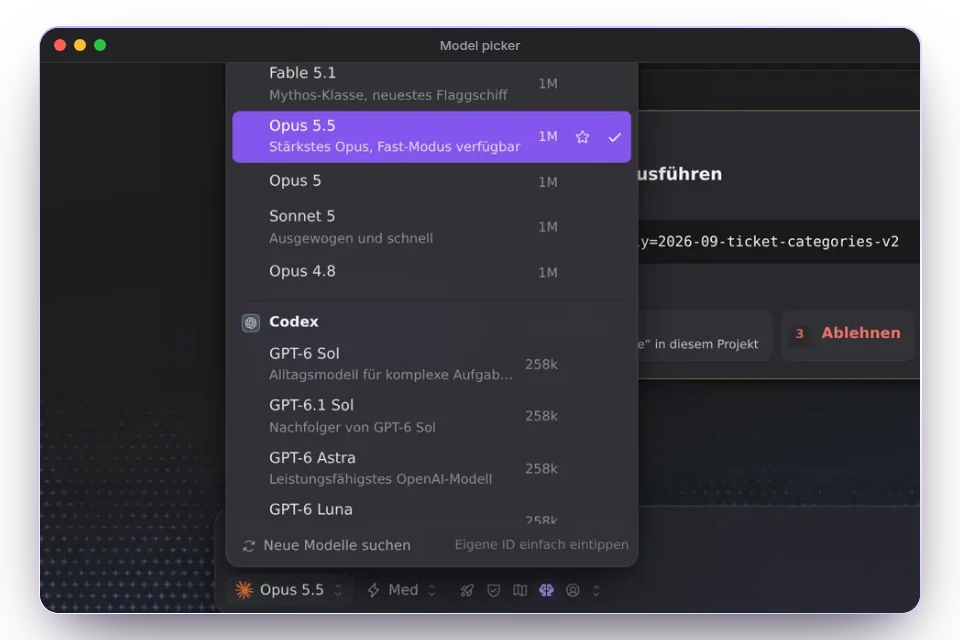
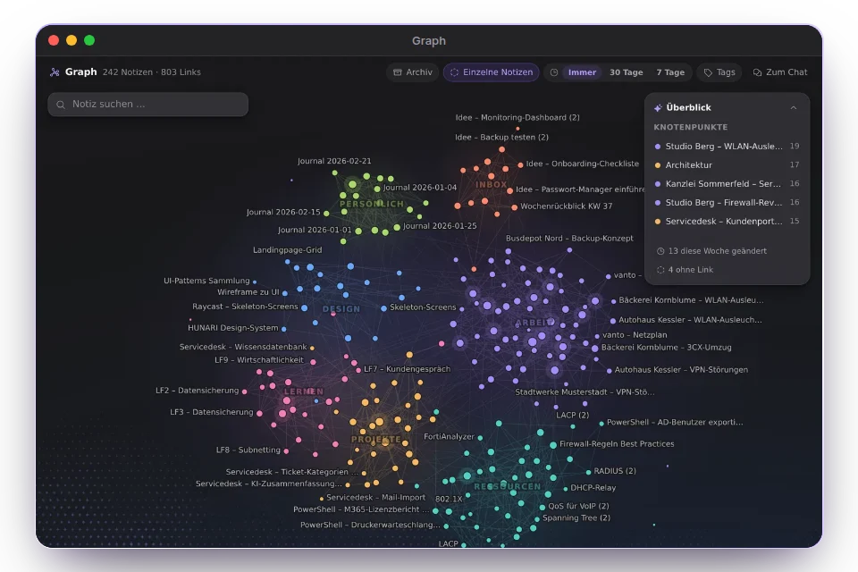
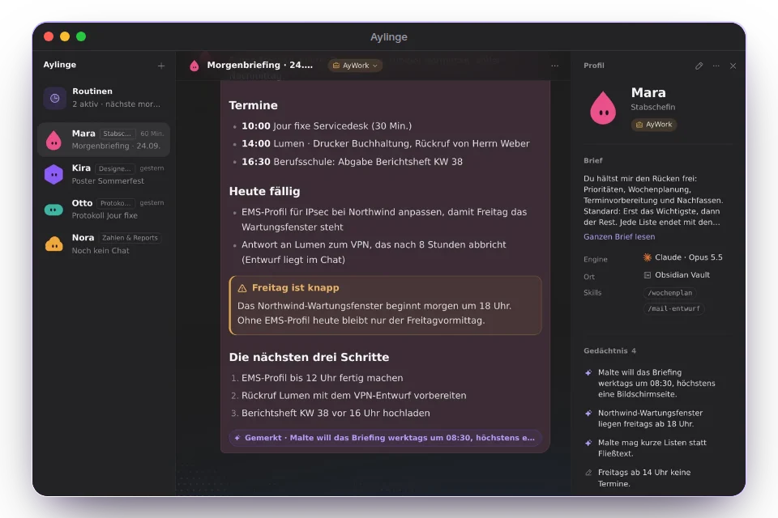
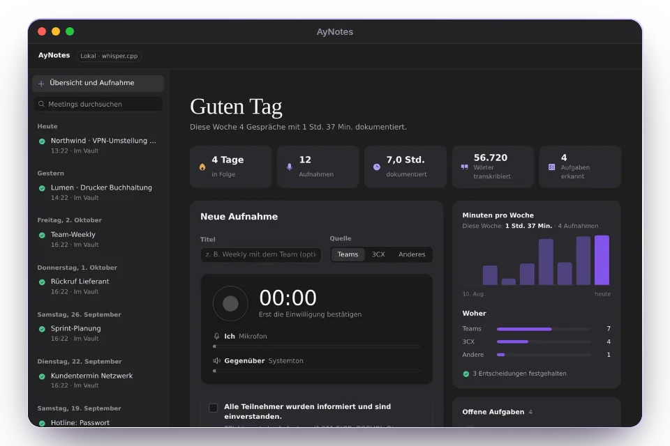
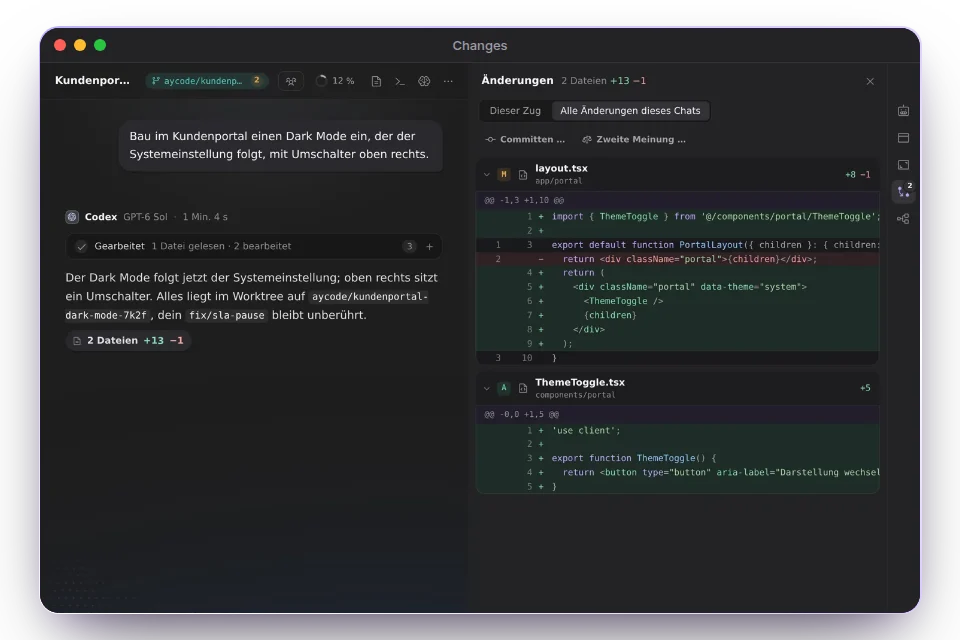
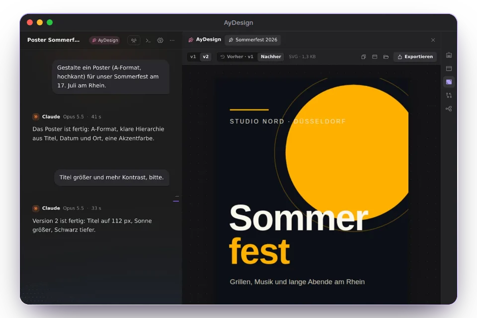

<b>English</b> · <a href="README.de.md">Deutsch</a>

<a href="https://aycode.ai/"><picture>
  <source media="(prefers-color-scheme: dark)" srcset="https://aycode.ai/assets/bg/hero-dusk.webp">
  <source media="(prefers-color-scheme: light)" srcset="https://aycode.ai/assets/bg/hero-dawn.webp">
  
</picture></a>

<a href="https://aycode.ai/"><picture>
  <source media="(prefers-color-scheme: dark)" srcset="https://aycode.ai/assets/brand/ribbon-dark.png">
  <source media="(prefers-color-scheme: light)" srcset="https://aycode.ai/assets/brand/ribbon-light.png">
  
</picture></a>

<h1 align="center">Your coding agents. In <i>one calm app</i>.</h1>

AyCode runs Claude Code, Codex, Gemini, Grok, OpenCode and other coding agents side by side in one desktop app for Mac, Windows and Linux (beta). Your Obsidian vault becomes the second brain behind their answers.

<a href="https://aycode.ai/"><b>Website</b></a>&nbsp;&nbsp;·&nbsp; <a href="https://aycode.ai/#download"><b>Download</b></a>&nbsp;&nbsp;·&nbsp; <a href="https://aycode.ai/docs/"><b>Docs</b></a>&nbsp;&nbsp;·&nbsp; <a href="https://aycode.ai/changelog/"><b>Changelog</b></a>&nbsp;&nbsp;·&nbsp; <a href="https://aycode.ai/#tour"><b>Film</b></a>&nbsp;&nbsp;·&nbsp; <a href="https://github.com/Ayont/AyCode/stargazers"><b>⭐ Star</b></a>

 

<h3 align="center">Your agents write the code. AyCode keeps the rest <i>calm</i>.</h3>

One window for your models, your notes as their memory, your phone as the remote, your team in the same room.

<b>Fig. 1</b> · Paper: your notes, the way you wrote them <b>Fig. 2</b> · Horizon: one calm window for your agents <b>Fig. 3</b> · Crystal: a second brain that grows with every chat

<h2>What is AyCode?</h2>

AyCode is a desktop app (GUI) for coding agents on macOS, Windows and Linux (beta). Instead of juggling <b>Claude Code</b>, <b>OpenAI Codex</b>, <b>Antigravity with Gemini</b>, <b>Grok</b>, <b>OpenCode</b>, <b>Cline</b>, <b>Kimi Code</b> and other AI agents in separate terminal tabs, you run them side by side in one calm window: with live diffs, approvals, git worktrees, a model picker, cost tracking and your Obsidian notes as long-term memory. Agentic coding and vibe coding, without losing track.

<h2 align="center">Built around the <i>agent</i></h2>

Context, memory, review, and a way back to your work from anywhere.

<table>
<tr>
<td width="50%" valign="top">

<h3>Your agents, one window</h3>

Claude Code, Codex, Gemini, Grok, OpenCode, Cline, Kimi, Pi, Z.ai and more side by side. Switch the model in the middle of a chat, or send one prompt to several and compare the answers.

</td>
<td width="50%" valign="top">

<h3>A second brain from your vault</h3>

AyCode reads your Obsidian notes, links and tags in the background and hands the right ones to the agent. The graph shows how your knowledge connects.

</td>
</tr>
<tr>
<td width="50%" valign="top">

<h3>Aylinge, your agent crew</h3>

Agents with a name, a memory and routines. Put several into a group chat, mention one with @name or everyone with @all, and mix providers in the same room.

</td>
<td width="50%" valign="top">

<h3>AyNotes</h3>

Record meetings and calls with everyone’s consent. Transcript, summary and tasks land as a note in your vault.

</td>
</tr>
<tr>
<td width="50%" valign="top">

<h3>Parallel in worktrees</h3>

Several agents at once, each on its own branch. Watch the changes line by line as they happen, comment on the diff, and let a second model review it before you merge or open a pull request.

</td>
<td width="50%" valign="top">

<h3>AyWork and AyDesign</h3>

Documents, spreadsheets, slides and posters take shape live on a canvas while the agent writes them. AyWork opens real Excel, CSV and Word files, and older versions are one click away.

</td>
</tr>
</table>

<h3 align="center">Made for the <i>moments</i> around the code</h3>

<table>
<tr>
<td width="33%" valign="top"><b>Quick chat</b> <kbd>⌥ Space</kbd> asks your agent from any app.</td>
<td width="33%" valign="top"><b>/btw</b> A side question while the main task keeps running.</td>
<td width="33%" valign="top"><b>The Island</b> Your agents at the Mac’s notch: who is working, who is waiting for you.</td>
</tr>
<tr>
<td width="33%" valign="top"><b>Dictation</b> Hold right <kbd>⌥</kbd> and speak into any app; a dictionary learns your words.</td>
<td width="33%" valign="top"><b>Council of five</b> Ask the group to vote. Every Ayling answers, AyCode counts the votes.</td>
<td width="33%" valign="top"><b>Control the computer</b> Switch it on in a chat and the agent clicks and types for you. <kbd>Esc</kbd> stops it.</td>
</tr>
<tr>
<td width="33%" valign="top"><b>Move in</b> Bring your chats from T3 Code, Cursor, Cline, Claude Code, Codex and more.</td>
<td width="33%" valign="top"><b>Team sessions</b> Code together live; guests join in the browser.</td>
<td width="33%" valign="top"><b>Know the cost</b> What each agent and model cost this week, with budgets you set yourself.</td>
</tr>
<tr>
<td width="33%" valign="top"><b>Two chats at once</b> Side by side, or a chat in its own window.</td>
<td width="33%" valign="top"><b>iPhone & Apple Watch</b> Read, answer and approve on the go. Beta in TestFlight.</td>
<td width="33%" valign="top"><b>Companions</b> 25 little figures react to what your agents do.</td>
</tr>
</table>

<h2 align="center">AyCode in <i>motion</i></h2>

<a href="https://aycode.ai/#tour"><b>▶ Watch the film</b></a>&nbsp;&nbsp;·&nbsp;&nbsp;1:05 on aycode.ai 
The evening scenes, the voices and the music are AI-generated. Linux is still in beta. On Windows 11 with Smart App Control turned on, the installer doesn’t start yet because it doesn’t carry a Windows certificate yet.

<h2 align="center">The agents you <i>already</i> use</h2>

<b>Claude Code</b> · <b>Codex</b> · <b>Antigravity</b> with Gemini · <b>Grok</b> · <b>OpenCode</b> · <b>Cline</b> · <b>Kimi Code</b> · <b>Pi</b> · <b>Mistral Vibe</b> · <b>Z.ai</b> · <b>DeepSeek</b> · <b>Hermes</b> · local models through <b>Ollama</b> or <b>LM Studio</b>

Sign in once per provider, or add an API key. AyCode starts their official tools on your computer, so your code stays yours. <b>No tokens resold.</b>

<picture>
  <source media="(prefers-color-scheme: dark)" srcset="https://aycode.ai/assets/look/schwarm.webp">
  <source media="(prefers-color-scheme: light)" srcset="https://aycode.ai/assets/home/schwarm-morgen.webp">
  
</picture>

<h2 align="center">Get <i>AyCode</i></h2>

Free for Mac, Windows and Linux (beta). After that, AyCode updates itself.

<table>
<tr><th>System</th><th>Requirements</th><th>File</th></tr>
<tr><td><b>macOS</b></td><td>Apple Silicon (M1 or newer), macOS 12 or later</td><td><code>.dmg</code></td></tr>
<tr><td><b>Windows</b></td><td>Windows 10 or 11, 64-bit</td><td><code>.exe</code> installer or portable <code>.zip</code></td></tr>
<tr><td><b>Linux</b> (beta)</td><td>64-bit (x86_64): Ubuntu, Debian, Fedora and others</td><td><code>.AppImage</code> or <code>.deb</code></td></tr>
<tr><td><b>iPhone & Apple Watch</b></td><td>iOS 18+ · watchOS 11+ · a reachable AyCode computer</td><td><a href="https://testflight.apple.com/join/b5zYjCHJ">Beta in TestFlight</a>, Apple’s review pending</td></tr>
</table>

- <b>Mac:</b> signed with Developer ID and notarized by Apple, so it opens without a detour through System Settings.
- <b>Windows:</b> if SmartScreen warns you, choose <i>More info → Run anyway</i>. On Windows 11 with Smart App Control turned on, the installer doesn’t start yet because it doesn’t carry a Windows certificate yet.
- <b>Linux:</b> make the AppImage executable (<code>chmod +x</code>) and start it, or install the .deb with apt. Linux is still in beta.

Every update is signed and verified: each release carries <code>SHA256SUMS</code> and <code>SHA256SUMS.sig</code>, and AyCode installs an update only with a valid signature.

<h2 align="center">Up and running in <i>three</i> steps</h2>

<table>
<tr>
<td width="33%" valign="top" align="center"><h3>1</h3><b>Download</b> Pick your system on <a href="https://aycode.ai/#download">aycode.ai</a>. The file comes straight from this repository.</td>
<td width="33%" valign="top" align="center"><h3>2</h3><b>Open</b> On a Mac, drag AyCode into Applications. On Windows, run the installer. On Linux, start the AppImage or install the .deb.</td>
<td width="33%" valign="top" align="center"><h3>3</h3><b>Sign in to your agents</b> Once per provider, or add an API key. AyCode finds your Obsidian vault and the chats you already have.</td>
</tr>
</table>

<h2 align="center">What’s <i>new</i></h2>

<table>
<tr><td width="96" align="center"><a href="https://github.com/Ayont/AyCode/releases/tag/v7.4.2"><b>7.4.2</b></a></td><td>The Mac app is signed with Developer ID and notarized, the iPhone and Apple Watch beta is in TestFlight, and catalog connectors start Docker only with safe switches.</td></tr>
<tr><td width="96" align="center"><a href="https://github.com/Ayont/AyCode/releases/tag/v7.4.0"><b>7.4.0</b></a></td><td>Your own AyCode account, connectors in one click, and spreadsheets that look like the Excel file.</td></tr>
<tr><td width="96" align="center"><a href="https://github.com/Ayont/AyCode/releases/tag/v7.3.0"><b>7.3.0</b></a></td><td>AyWork opens real Excel, CSV and Word files, a video studio cuts an agent’s video on a timeline, and videos play right in the chat.</td></tr>
<tr><td width="96" align="center"><a href="https://github.com/Ayont/AyCode/releases/tag/v7.2.1"><b>7.2.1</b></a></td><td>Agents that use your computer and hand off work, AyCode in English, a new look on a calm stage, and two chats side by side.</td></tr>
</table>

<a href="https://aycode.ai/changelog/"><b>All release notes →</b></a>

<h2>FAQ</h2>

<b>Is AyCode free?</b>

 
Yes, AyCode is free to download and use. The agents run as they are signed in on your computer, or with your own API keys, and AyCode resells no tokens.
  

<b>Is AyCode open source?</b>

 
No. The source code is private. This repository hosts the installers, the update feed and the release notes.
  

<b>Does my code leave my computer?</b>

 
The agents run on your computer through their official tools, and your prompts go only to the provider you chose. AyCode Cloud is optional: it carries the phone connection on the go, end-to-end encrypted backups and team sessions.
  

<b>Do I need Obsidian?</b>

 
No. AyCode reads an Obsidian vault if you have one and works fine without.
  

<b>Which systems does it run on?</b>

 
Macs with Apple Silicon, Windows 10 and 11, and 64-bit Linux as a beta (AppImage or .deb). The iPhone and Apple Watch companion is in TestFlight, pending Apple’s review, and connects to your running AyCode computer.
  

<b>Where is the documentation?</b>

 
<a href="https://aycode.ai/docs/">aycode.ai/docs</a> walks you through the app, chapter by chapter.
  

 

If AyCode helps you, a <a href="https://github.com/Ayont/AyCode/stargazers"><b>⭐ star</b></a> helps others find it.

<b>Tell a friend:</b>&nbsp; <a href="https://x.com/intent/post?text=AyCode%3A%20your%20AI%20coding%20agents%20(Claude%20Code%2C%20Codex%2C%20Gemini%2C%20Grok%2C%20OpenCode%20%E2%80%A6)%20in%20one%20calm%20desktop%20app&url=https%3A%2F%2Fgithub.com%2FAyont%2FAyCode">X</a>&nbsp;&nbsp;·&nbsp; <a href="https://www.reddit.com/submit?url=https%3A%2F%2Fgithub.com%2FAyont%2FAyCode&title=AyCode%3A%20your%20AI%20coding%20agents%20(Claude%20Code%2C%20Codex%2C%20Gemini%2C%20Grok%2C%20OpenCode%20%E2%80%A6)%20in%20one%20calm%20desktop%20app">Reddit</a>&nbsp;&nbsp;·&nbsp; <a href="https://news.ycombinator.com/submitlink?u=https%3A%2F%2Fgithub.com%2FAyont%2FAyCode&t=AyCode%3A%20your%20AI%20coding%20agents%20(Claude%20Code%2C%20Codex%2C%20Gemini%2C%20Grok%2C%20OpenCode%20%E2%80%A6)%20in%20one%20calm%20desktop%20app">Hacker News</a>&nbsp;&nbsp;·&nbsp; <a href="https://www.linkedin.com/sharing/share-offsite/?url=https%3A%2F%2Fgithub.com%2FAyont%2FAyCode">LinkedIn</a>

<picture>
  <source media="(prefers-color-scheme: dark)" srcset="https://aycode.ai/assets/look/see-abend-1600.webp">
  <source media="(prefers-color-scheme: light)" srcset="https://aycode.ai/assets/look/see-morgen-1600.webp">
  
</picture>

<a href="https://aycode.ai/">aycode.ai</a>&nbsp;&nbsp;·&nbsp; <a href="https://aycode.ai/docs/">Docs</a>&nbsp;&nbsp;·&nbsp; <a href="https://aycode.ai/changelog/">Changelog</a>&nbsp;&nbsp;·&nbsp; <a href="https://x.com/AyCodeAI">X @AyCodeAI</a>&nbsp;&nbsp;·&nbsp; <a href="https://www.instagram.com/aycodeai/">Instagram @aycodeai</a>&nbsp;&nbsp;·&nbsp; <a href="https://www.linkedin.com/company/aycodeai/">LinkedIn</a>&nbsp;&nbsp;·&nbsp; <a href="https://aycode.ai/imprint/">Imprint</a>&nbsp;&nbsp;·&nbsp; <a href="https://aycode.ai/privacy/">Privacy</a>

